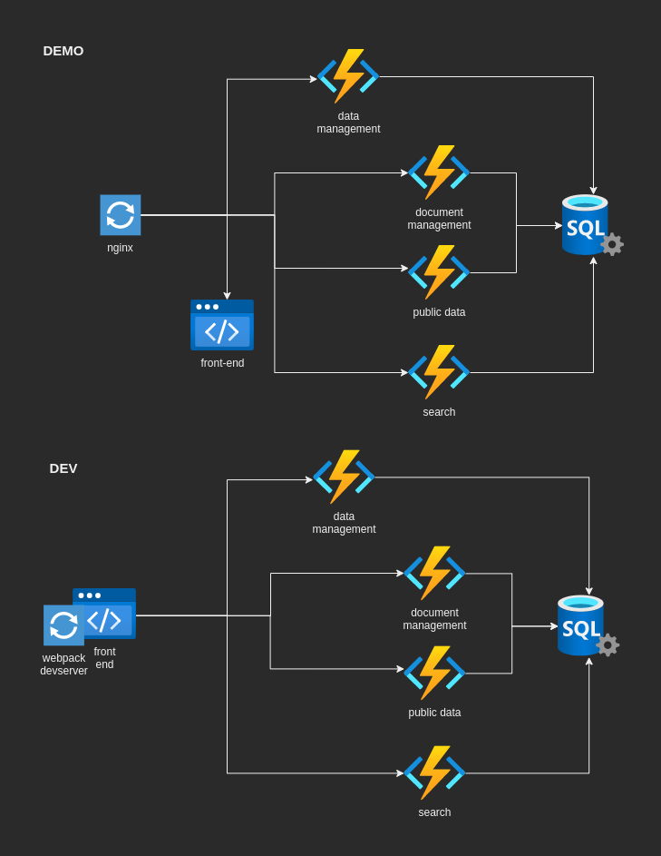

# WHO - BioHub <!-- omit in TOC -->

## Index <!-- omit in TOC -->

- [Architecture](#architecture)
- [Source code on Windows](#source-code-on-windows)
- [Run Demo](#run-demo)
- [Run for development](#run-for-development)
  - [Run, migrate, and seed the database](#run-migrate-and-seed-the-database)
  - [Configure Projects](#configure-projects)
    - [Back-end services (Data Management, Document Management, Search, Public Data, ...)](#back-end-services-data-management-document-management-search-public-data-)
      - [Run from Terminal](#run-from-terminal)
      - [Run from Visual Studio](#run-from-visual-studio)
    - [Run Front-end from Terminal](#run-front-end-from-terminal)
      - [Run Front-end errors](#run-front-end-errors)
- [Work with Database](#work-with-database)

## Architecture



## Source code on Windows

> [!IMPORTANT]
> The commands must be executed before starting to work on the project, otherwise the changes may be lost

Windows uses both a carriage return and a line feed character for new lines, while only a feed character is used in project files. To avoid the formatting errors, the automatic conversion function of GIT in Windows must be disabled by running the following commands:

```bash
git config core.autocrlf false  # disable Windows automatic end-of-line conversion in git repository

git rm --cached -r . # delete the git cache

git reset --hard # restore the current HEAD to its last state
```

## Run Demo

To run a simple demo, i.e. the complete environment, you can rely on the rules in the [Makefile](./src/Makefile) in the `src/` folder.

```bash
#!/bin/bash

make run-demo     # or `run-demo-detached` for no interactive logs
```

Alternatively, you can execute directly the command invoked by the Makefile's rule.

```bash
#!/bin/bash

docker compose \
    -f docker-compose.yml \
    -f docker-compose.demo.yml \
    up --build # `-d` for detached mode
```

These commands will provide you with a complete environment where the following configurations applies:

- a `reverse-proxy` (NGINX) is published on port 12000
- `front-end` is published on port 12080
- `Data Management` function is published on port 12081
- `Document Management` function is published on port 12082
- `MS SQL Server` is published on port 14330

To access the published service, please use the NGINX address: [http://localhost:12000](http://localhost:12000).

To cleanup the system deleting the created containers, volumes, and network you can rely on the rules in the [Makefile](./src/Makefile) in the `src/` folder.

```bash
#!/bin/bash

make clean-demo
```

Alternatively, you can execute directly the command invoked by the Makefile's rule.

```bash
#!/bin/bash

docker compose \
    -f docker-compose.yml \
    -f docker-compose.demo.yml \
    down
```

## Run for development

### Run, migrate, and seed the database

If you want to run only the database and execute the other services locally, you can rely on `dev` rules of Makefile.

```bash
#!/bin/bash

make run-dev-infra     # or `run-dev-infra-detached` for no interactive logs
```

Alternatively, you can execute directly the command invoked by the Makefile's rule.

```bash
#!/bin/bash

docker compose \
    -f docker-compose.yml \
    -f docker-compose.demo.yml \
    up --build # `-d` for detached mode
```

### Configure Projects

Here below some details related to the project configuration.

#### Back-end services (Data Management, Document Management, Search, Public Data, ...)

> This part of the documentation is focused on the Data Management Function,
> but it is equivalent for all the other back-end services

Make sure to have the latest version of [Azure Function Core Tools](https://github.com/Azure/azure-functions-core-tools).

To check the Azure Function Core Tools installed version use the command below.

```bash
#!/bin/bash

func --version
```

On Windows, you can leverage on `choco` to install/update packages.
If you don't have `choco` installed, please follow this [link](https://chocolatey.org/install).
You can search for new versions with the below command:

```console
choco search azure-functions-core-tools
```

To install a new version use the following command:

```console
choco install azure-functions-core-tools
```

##### Run from Terminal

To run the Function App locally, you can rely on the `run-dev-funcdata` Makefile's rule.

```bash
#!/bin/bash

make run-dev-funcdata
```

Alternatively, you can execute directly the command invoked by the Makefile's rule.

```bash
#!/bin/bash

cd "be/src/DataManagement/WHO.BioHub.DataManagement.FunctionApp"

ConnectionStrings__SQLServer="Server=localhost,14330;Database=biohub;User ID=sa;Password=Sup3rsecret;TrustServerCertificate=True" \
OpenApi__HostNames="http://localhost:12081/api" \
    func start --csharp --port 12081
```

##### Run from Visual Studio

Please use the following configuration in the launchSettings.json file.
The file is located in this folder `src\be\src\DataManagement\WHO.BioHub.DataManagement.FunctionApp\Properties`

```json
{
  "profiles": {
    "WHO.BioHub.DataManagement.FunctionApp": {
      "commandName": "Project",
      "commandLineArgs": "--csharp --port 12081",
      "environmentVariables": {
        "ConnectionStrings__SQLServer": "Server=localhost,14330;Database=biohub;User ID=sa;Password=Sup3rsecret;TrustServerCertificate=True",
        "OpenApi__HostNames": "http://localhost:12081/api"
      }
    }
  }
}
```

#### Run Front-end from Terminal

To run the front-end locally, you can rely on the `run-dev-fe` Makefile's rule.

```bash
make run-dev-fe
```

Alternatively, you can execute directly the command invoked by the Makefile's rule.

```bash
cd "fe/"

VUE_APP_API_DATA_URL="http://localhost:12000/api/data" \
VUE_APP_API_PUBLICDATA_URL="http://localhost:12000/api/publicdata" \
VUE_APP_API_BE_PUBLICDATA_URL="http://localhost:12084/api/" \
VUE_APP_API_BE_DATA_URL="http://localhost:12081/api/" \
VUE_APP_API_DOCUMENT_URL="http://localhost:12000/api/document" \
VUE_APP_API_BE_DOCUMENT_URL="http://localhost:12082/api/" \
PORT=12000 \
VUE_APP_PROXY_PORT=12000 \
    npm run serve
```

#### Run Front-end errors

**1. "the yarn command was not found"**:

Run the following command to solve the problem

```shell
npm install --global yarn
```

## Work with Database

This project mainly leverages on SQL Database and Entity Framework Core.
To create new Entity Framework Core migration, please install `dotnet-ef` using command:

```console
dotnet tool install --global dotnet-ef --version <VERSION>**
```

To add a new migration, please go to `src/be/scripts` where the script `add-migration.sh` is located.
You have to execute it in a terminal.

Please find the command below:

```bash
#!/bin/bash

./add-migration.sh "{NameOfNewMigration}"
```

To apply migrations you can leverage on the project [`src/be/src/WHO.BioHub.DAL.Migrator`](src/be/src/WHO.BioHub.DAL.Migrator/README.md).
